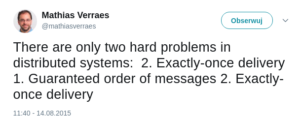

---?image=http://coredump.events/img/heroBG.jpg&size=cover

# @color[white](What Apache Kafka is not?)


---?image=http://ocdn.eu/pulscms-transforms/1/AO9ktkpTURBXy8yNzc1OWY4MGEwNzU1ODUwMGUzMjBkNmZhYWYzZGFkOS5qcGeSlQLNA8AAwsOVAgDNA8DCww&size=cover

--- 

@snap[west]
## About me

Mariusz Strzelecki<br/>

Data engineer @ <br />

4 years with Hadoop/Spark/Kafka
@snapend

@snap[east]

@snapend

--- 

# Publish-subscribe

---?image=assets/images/story01.png&size=contain

---?image=assets/images/story02.png&size=contain

---?image=assets/images/story03.png&size=contain

---?image=assets/images/story04.png&size=contain

---

# Use cases

- asynchronous, event-driven microservices communication |
- change notification/cache invalidation |
- task queue |
- Internet Of Things |

Note:
gry multiplayer
reagowanie na zmiany cen akcji

---?image=assets/images/architect-254579_1920.jpg&size=cover

---

# Key features

- distributed
- fast
- reliable
- easy API

---?image=assets/images/impl01.png&size=contain

---?image=assets/images/impl02.png&size=contain

---

```java
@RestController
public class EasyMessageBroker {
  private final Database db;

  @PostMapping
  public void addEvent(@RequestBody Event event) {
    db.save(event);
  }

  @GetMapping
  public Event getEvent() {
    Event event = db.findOne();
    db.delete(event);
    return event;
  }
}
```

---?image=assets/images/impl03.png&size=contain

---?image=assets/images/impl04.png&size=contain

---?image=assets/images/impl05.png&size=contain

---?image=assets/images/impl06.png&size=contain

---

## What about High Availability?

- producers ✓
- brokers ☹
- consumers ☹

---?image=assets/images/impl07.png&size=contain

---?image=assets/images/impl08.png&size=contain

---?image=assets/images/impl09.png&size=contain

---

## What about High Availability?

- producers ✓
- brokers ✓
- consumers ☹

---?image=assets/images/impl10.png&size=contain

Note:
rozkładanie obciążenia

---?image=assets/images/impl11.png&size=contain

---?image=assets/images/impl12.png&size=contain

---?image=assets/images/impl13.png&size=contain

---

## What about High Availability?

- producers ✓
- brokers ✓
- consumers ✓

---

## Disk space is not infinite...

---?image=assets/images/impl14.png&size=contain

---

## "I'd like to start reading at offset 9881292"

---?image=assets/images/impl15.png&size=contain

---?image=https://kafka.apache.org/images/logo.png&size=contain

---

# Kafka

- doesn't cache data |
- doesn't maintain cluster configuration |
- implements local requests queue |
- performs data compactation |

---

## Message delivery guarantees



---

## Ordering

- only within partition |
- managed by a leader, replicated to followers |

---

## At-least-once

---?image=assets/images/atleastonce01.png&size=contain

---?image=assets/images/atleastonce02.png&size=contain

---

## At-most-once

---?image=assets/images/atmostonce01.png&size=contain

---?image=assets/images/atmostonce02.png&size=contain

---

## Exactly-once

---?image=assets/images/exactlyonce01.png&size=contain

---?image=assets/images/exactlyonce02.png&size=contain

---

## Security features

- data "at rest" are stored plain |
- TLS for brokers authentication |
- TLS or Kerberos (SASL) for producers/consumers authentication |
- ACL-based authorization (for topics and consumer groups) |

---

## Kafka's weak points

- no support for retries on consuming side |
- message filtering capabilities are missing |
- "pull" mode for consumers only |
- shouldn't share VM across other services |
- no UI in the standard package |
- not the most lightweight protocol for IoT |

---

## What amazed me in Kafka?

- easy foundations → brilliant result |
- perfect scalability |
- works well for every possible event-driven design |

Note:
skalowalność, bezpieczeństwo danych, niezawodność, wysoka wydajność

---

## How to start?

Docker: @fa[github] wurstmeister/kafka-docker

Kubernetes: @fa[github] confluentinc/cp-helm-charts

Non-virtualized: [confluent.io/download](confluent.io/download)

---

# Thank you

## Questions time!

<br/><br />

@size[0.75em](We're hiring! [fandom.wikia.com/careers](fandom.wikia.com/careers)) 
