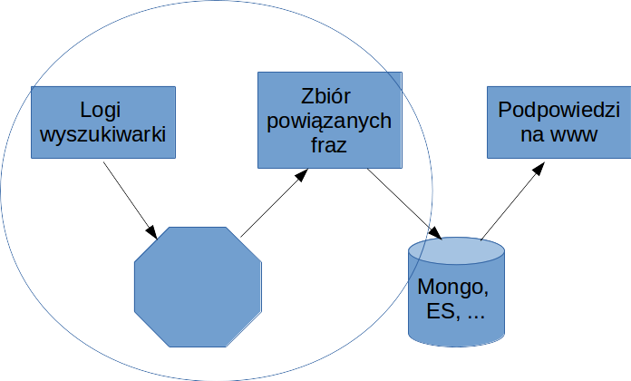

# Czy chodziło Ci o... ?


Mariusz Strzelecki

---

# Rekomendacje dla wyszukiwarki

---


---


---


---

# Środowisko

- Spark (scala/python)
- Notatniki 
- Databricks (6.5GB RAM, 8 CPU?)

---

# Dane

- [Logi wyszukiwarki AOL](http://www.cim.mcgill.ca/~dudek/206/Logs/AOL-user-ct-collection/U500k_README.txt)
- Leżą na S3 (https://pastebin.com/LbwRGBUv)

```
$ s3cmd ls s3://torun-jug-spark/aol-search-logs/ | cut -d' ' -f3-
        0   s3://torun-jug-spark/aol-search-logs/
 44961123   s3://torun-jug-spark/aol-search-logs/user-ct-test-collection-01.txt.gz
 45909232   s3://torun-jug-spark/aol-search-logs/user-ct-test-collection-02.txt.gz
 46632841   s3://torun-jug-spark/aol-search-logs/user-ct-test-collection-03.txt.gz
 46236686   s3://torun-jug-spark/aol-search-logs/user-ct-test-collection-04.txt.gz
 48205554   s3://torun-jug-spark/aol-search-logs/user-ct-test-collection-05.txt.gz
 44916910   s3://torun-jug-spark/aol-search-logs/user-ct-test-collection-06.txt.gz
 46175060   s3://torun-jug-spark/aol-search-logs/user-ct-test-collection-07.txt.gz
 45663522   s3://torun-jug-spark/aol-search-logs/user-ct-test-collection-08.txt.gz
 45826468   s3://torun-jug-spark/aol-search-logs/user-ct-test-collection-09.txt.gz
 45734730   s3://torun-jug-spark/aol-search-logs/user-ct-test-collection-10.txt.gz

```

---

# Założenia

1. Użytkownik wie, czego szuka
  - nie wpisuje liter na oślep
  - odrzucamy boty
2. Jeśli użytkownik szuka czegoś wiele razy - traktujemy jako jedno wyszukanie (distinct)
3. Stosujemy [Association rule learning](https://en.wikipedia.org/wiki/Association_rule_learning), jak sugerują [brazylijscy naukowcy](http://homepages.dcc.ufmg.br/~nivio/papers/laweb03-2.ps)

---

# Definicje: Support


Dla nas: ilość użytkowników, którzy wpisali frazę _x_

---

# Definicje: Confidence


Dla nas: ilość uzytkowników, którzy wpisywali frazę _x_ i _y_ dzielone przez liczbę tych, którzy wpisali tylko _x_.

---

# Czego szukamy?

Dla frazy _x_ zaproponujemy inne o minimalnym _supporcie_ == 3 i najwyższym _confidence_



---

# Do dzieła!

### https://community.cloud.databricks.com/
