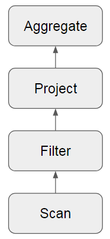

## Apache Spark, czyli jak wycisnąć z JVMa więcej niż fabryka dała

@JDD2017

---

## O mnie

<ul>
<li class="fragment">Mariusz Strzelecki</li>
<li class="fragment"></li>
<li class="fragment"></li>
</ul>

---


+++

## Dlaczego Spark jest napisany w Scali?

- 2009: Scala świętuje 5. urodziny |
- zwięzłe, przyjazne api |
- interpreter |
- statyczne typowanie |
- serializacja funkcji |

Note:
- Hadoop jest już w Javie - zgodność z całością ekosystemu
- Matei Zaharia
- Zwięzłe, przyjazne api, podobne do LINQ
- Scala shell intepreter do eksploracji danych
- Nie Jython ani Groovy, bo Scala jest statycznie typowana, więc można zastosować więcej sztuczek wydajnośiowych
- W scali można wygodnie serializować funkcje i przesyłać je siecią

+++

## OLTP vs. OLAP

- narzuty pamięci |
- duża ilość referencji |
- GC |

Note:

- Boxing zmiennych - przykład z jdd2017
- Sortowanie -> słabe układy pamięci / Serializacja - wymaga skakania po pamięci 
- Garbage collector na niemutowalnych danych

+++

## Ile pamięci zajmują napisy?

 -  `"jdd2017"`
 - 8 bajtów?  |
 - 16 bajtów? |
 - 56 bajtów! |

Note:
- compressed OOPS

+++

```
 	new String("jdd2017")

    12 | header 
     4 | char[] reference -------> 12 | header
     4 | String.hash               14 | char[] (UTF-16)
     4 | String.hash32              6 | padding
```

- [JEP-254](http://openjdk.java.net/jeps/254) na ratunek!


Note:
- object's class, ID and status flags such as whether the object is currently reachable, currently synchronization-locked etc.
- w javie 9 - 48 bajtów

---?image=assets/images/tungsten.jpg&size=cover

<h2 style='color: white;'>2015: Project Tungsten<br /><br /><br /><br /><br /><br /><br /></h2>

+++


+++

## Hardware - trendy

<table>
  <tr>
    <th></th>
    <th>Dysk</th>
    <th>Sieć</th> 
    <th>CPU</th>
  </tr>
  <tr>
    <td>2010</td>
    <td>50 MB/s</td>
    <td>1 GBps</td>
    <td>~3 GHz</td>
  </tr>
  <tr class="fragment">
    <td>2015</td>
    <td>500 MB/s</td>
    <td>10 GBps</td>
    <td>~3 GHz</td>
  </tr>
  <tr class="fragment">
    <td>2020</td>
    <td>?</td>
    <td>?</td>
    <td>~3 GHz</td>
  </tr>
</table>

Note:
- IO w sparku i tak zostało zoptymalizowane 
- Pojawiły się kolumnowe formaty danych
- CPU wciąż jest wąskim gardłem, taki jest też spodziewany trend
- rola CPU w przetwarzaniu: serializacja, hashowanie, kompresja

---?image=https://www.quietpc.com/images/products/nh-d15s-large.jpg&size=contain

+++

## UTF8String 

byte[] + ilość elementów

Note:
- 50% oszczędności RAM
- wady - w UDFach trzeba transformować na String i w drugą stronę	

+++?image=assets/images/classic_row.png&size=auto

+++

## sun.misc.Unsafe

Note:
- niskopoziomowe zarządzanie, m.in. pamiecią
- jawna alokacja/zwalnianie pamięci
- implementacja mocno zależy od platformy!

+++

## UnsafeRow


- wydajne przechowywanie danych |
- trywialna serializacja i proste porównywanie | 
- spilling |

Note:
 * wydajne pamięciowo przechowwyanie danych
 * serializacja: unikanie niepotrzebnych skoków po referencjach
 * equals() to porównwanie bajtów
 * proste obliczanie rozmiaru danych (ułatwia spilling na dysk), wcześniej heurystyki i aproksymacje

+++?image=assets/images/spark_unsafe.png&size=auto

+++ 

## TaskMemoryManager

- obsługi wirtualnej adresacji stron
  - Off-heap: `java.nio.DirectByteBuffer` z "podstawionym buforem"
  - On-heap: jako `long[]`

Note:
- unikanie złych praktyk ze skakaniem po pamięci
- pozbywanie się nadmiernego GC
- w on-heap java może dowolnie przenosić strony, potrzebna tablica stron

---?image=http://media.licdn.com/mpr/mpr/shrinknp_800_800/AAEAAQAAAAAAAAOiAAAAJGU0NTk5ZTU4LTgxYzktNGY3YS05MWRlLTM4NDk2OTFiODlkMw.jpg&size=cover

+++

## Ilu jest uczestników JDD 2017?

```
df.where(df.conference == "jdd2017").count()
```

```
select count(*) from df where conference = "jdd2017"
```

Note:
- dla uproszczenia - na jednym nodzie

+++

## Model "Volcano"



+++

## Volcano i filtrowanie

```
case class FilterExec(condition: Expression, child: SparkPlan) {
  protected override def doExecute(): RDD[InternalRow] = {
    val numOutputRows = longMetric("numOutputRows")
    child.execute().mapPartitionsWithIndexInternal { (index, iter) =>
      val predicate = newPredicate(condition, child.output)
      predicate.initialize(0)
      iter.filter { row =>
        val r = predicate.eval(row)
        if (r) numOutputRows += 1
        r
      }
    }
  }
}
```

[basicPhysicalOperators.scala](https://github.com/apache/spark/blob/master/sql/core/src/main/scala/org/apache/spark/sql/execution/basicPhysicalOperators.scala)

+++

## Dedykowany kod

```
count = 0;
for (Record record: df) {
  if ("jdd2017".equals(record.getConference())) {
  	count++;
  }
}
```

Note:
 - kod nie jest komponowalny

+++


## Volcano vs. dedykowany kod

<canvas data-chart="horizontalBar">
<!-- 
{
 "data": {
  "labels": ["mln wierszy/s"],
  "datasets": [
   {
    "data":[13.95],
    "label":"Volcano","backgroundColor":"rgba(20,220,220,.8)"
   },
   {
    "data":[125],
    "label":"Dedykowany kod","backgroundColor":"rgba(220,120,120,.8)"
   }
  ]
 }, 
 "options": { "responsive": "true" }
}
-->
</canvas>

+++

| Volcano            | dedykowany kod       |
|--------------------|----------------------|
|wirtualne funkcje   | 0 funkcji            |
|skakanie po pamięci | dane w cache CPU     |
| ---                | loop unrolling, SIMD |

+++

## Whole-stage CodeGen 

## ([SPARK-12795](https://issues.apache.org/jira/browse/SPARK-12795))

- Job > Stage > Task |
- pozbieraj operacje z jednego Stage |
- wygeneruj klasę Javową |
- skompiluj do bytecodu |
- wykonaj |
- nie da się zastosować dla bibliotek i IO |

+++

## Przykład

```
df.where(df.conference == "jdd2017").count()
```


+++

```java
private void agg_doAggregateWithoutKey() throws java.io.IOException {
  // initialize aggregation buffer
  agg_bufIsNull = false;
  agg_bufValue = 0L;

  while (inputadapter_input.hasNext()) {
    InternalRow inputadapter_row = (InternalRow) inputadapter_input.next();
    boolean inputadapter_isNull = inputadapter_row.isNullAt(0);
    UTF8String inputadapter_value = inputadapter_isNull ? null : (inputadapter_row.getUTF8String(0));

    if (!(!(inputadapter_isNull))) continue;

    boolean filter_isNull2 = false;

    Object filter_obj = ((Expression) references[1]).eval(null);
    UTF8String filter_value4 = (UTF8String) filter_obj;
    boolean filter_value2 = false;
    filter_value2 = inputadapter_value.equals(filter_value4);
    if (!filter_value2) continue;

    filter_numOutputRows.add(1);

    // do aggregate
    // common sub-expressions

    // evaluate aggregate function
    boolean agg_isNull1 = false;

    long agg_value1 = -1L;
    agg_value1 = agg_bufValue + 1L;
    // update aggregation buffer
    agg_bufIsNull = false;
    agg_bufValue = agg_value1;
    if (shouldStop()) return;
  }
}
```

@[15-19](filtrowanie)
@[30-33	](zliczanie)

+++


## [Janino](http://janino-compiler.github.io/janino/)


Note:
janino wspiera kod zgodny z Javą 1.7 (z wyjątkami)

+++?image=assets/images/spark_java_generated_code.png&size=auto

+++

## Czy naprawdę warto?

|                      | OFF    | ON      |
|----------------------|--------|---------|
|filter                | 15 ns  | 1.1 ns  |
|sum w/o group         | 14 ns  | 0.9 ns  |
|sum w/ group          | 79 ns  | 10.7 ns |
|hash join             | 115 ns | 4.0 ns  |
|sort-merge join	   | 750 ns | 700 ns  |

[źródło](https://databricks.com/blog/2016/05/11/apache-spark-2-0-technical-preview-easier-faster-and-smarter.html)

+++

## Pozostałe optymalizacje

- Catalyst
- wektoryzacja 
- `BytesToBytesMap`
- "Cache-aware Computation", np. sortowanie z prefixami kluczy

---

# Podsumowanie

- Spark omija ograniczenia JVMa |
- sun.misc.Unsafe nie jest takie złe ;-) |
- czy da się wycisnąć więcej? |

Note:
- spark działa na JVM: przyczyna suckcesu, korzysta z bogactwa bibliotek
- omija ograniczenia tylko w przetwarzaniu, webui, komunikacja między nodami, optymalizacje planu wykonania - nie
- unsafe jest niebezpieczne w rękach progamisty, który przesiadł się z C
- w rękach inżyenia świadomego ograniczeń - jest OK

+++

### Dzięki! Pytania?


Note:
- [Flame graphs](https://db-blog.web.cern.ch/blog/luca-canali/2016-09-spark-20-performance-improvements-investigated-flame-graphs)
- https://www.slideshare.net/databricks/spark-performance-whats-next
- [Wektoryzacja, loop unrolling](https://spoddutur.github.io/spark-notes/second_generation_tungsten_engine.html)
- [Advanced meetup slajdy](https://www.slideshare.net/cfregly/advanced-apache-spark-meetup-project-tungsten-nov-12-2015)
- [Prezka databricksa](https://www.youtube.com/watch?v=5ajs8EIPWGI&t=335s)
- https://databricks.com/blog/2016/05/23/apache-spark-as-a-compiler-joining-a-billion-rows-per-second-on-a-laptop.html
- https://databricks.com/blog/2015/04/28/project-tungsten-bringing-spark-closer-to-bare-metal.html
