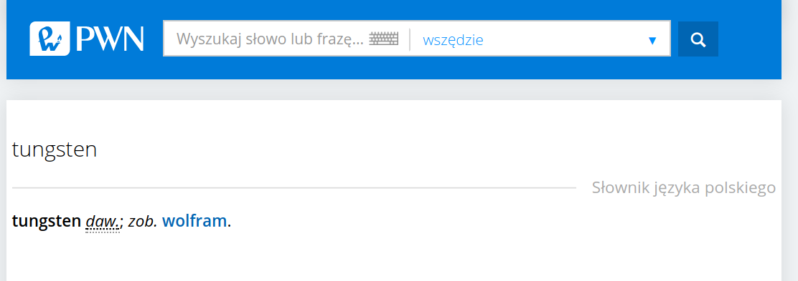

## Apache Spark, czyli jak wycisnąć z JVMa więcej niż fabryka dała

@JDD2017

Note:
będzie generalnie o optymalizacji JVM, a Spark jako przykład

---

## O mnie

- Mariusz Strzelecki
- 
- stackoverflow, tagi **spark** i **pyspark**

---


+++

Dlaczego Spark działa na JVM?

Note:
Hadoop jest już w Javie - zgodność z całością ekosystemy

+++

Dlaczego Spark w Scali?

Note:

* Zwięzłe, przyjazne api, podobne do LINQ
* Scala shell intepreter do eksploracji danych
* Nie Jython ani Groovy, bo Scala jest statycznie typowana, więc można zastosować więcej sztuczek wydajnośiowych
* W scali można wygodnie serializować funkcje i przesyłać je siecią
* Kiedy Spark powstawał (2009) Scala miała już 5 lat, Matei Zaharia

TODO: dodać jako listę

---

## JVM utrudnia pracę z dużymi danymi!

+++

## GC dobry dla OLTP, słaby w OLAP

+++

## Ile w JVM zajmuje napis `jdd2017`?

 - 7 bajtów?  |
 - 14 bajtów? |
 - 56 bajtów! |

Note:
* compressed OOPS

+++

```
 	new String("jdd2017")

    12 | header 
     4 | char[] reference -------> 12 | header
     4 | String.hash               14 | char[] (UTF-16)
     4 | String.hash32              6 | padding
```

 - [JEP-254](http://openjdk.java.net/jeps/254) na ratunek!


Note:
* object's class, ID and status flags such as whether the object is currently reachable, currently synchronization-locked etc.
* w javie 9 - 48 bajtów

+++

## JIT nie zawsze inline'uje metody

Note:

* inline nie działa dla długich metod i poliformizmu
* boxing wszystkich obiektów

+++

## Ostatnie 7 lat sparka:


|         | 2010          | 2017           |
| ------- |:-------------:|:--------------:|
| Dysk    | 50 MB/s (HDD) | 500 MB/s (SSD) |
| Sieć    | 1 Gbps        | 10 Gbps        |
| CPU     | ~3 Ghz        | ~3 Ghz         |

Note:
- IO w sparku i tak zostało zoptymalizowane 
- Pojawiły się kolumnowe formaty danych
- CPU wciąż jest wąskim gardłem, taki jest też spodziewany trend
- rola CPU w przetwarzaniu: serializacja, hashowanie, kompresja

---

## Projekt Tungsten

+++?image=http://periodictable.com/Samples/074.68/s12s.JPG&size=auto

+++



---

## Projekt Tungsten, faza 1

- zarządzanie pamięcią
- generowanie kodu
- optymalizacja użycia cache CPU

+++

- sun.misc.Unsafe
- pozbywanie się GC gdzie to tylko możliwe
- ograniczenie ilości pamięci (oszczędności na kompresji)
- złe praktyki dostępu do pamięci (String, HashMap)
- 

+++

## Nowe typy bazowe

UTF8String -> Array[Byte]

+++

## HashMap

- overhead pamięcii -> klucze i wartości to obiekty
- układ w pamięci nie pomaga CPU
- trudność w przeszukiwaniu (full-scan)


- BytesToBytesMap -> wydajne przeszukiwanie

+++

## UnsafeRow

- Wydajne zrzucanie danych na dysk (znamy dokładny rozmiar)
- `equals()` i `hashCode()` są niepotrzebne, wystarczy porównać binarnie bloki danych
- TaskMemoryManager do obsługi wirtualnej adresacji

+++

## Sortowanie

```
 4b          4b
--------------------               ------
|key-prefix|pointer| ------------> |data|
--------------------               ------
```


---

## Projekt Tungsten, faza 2

- Volcano -> generowanie kodu
- wektoryzacja

+++

## Volcano vs student

Volcano: 13.95 mln rekordów/sec
Kod: 125 mln rekordów/sec

| Volcano                 | kod studenta                     |
|-------------------------|----------------------------------|
|wiele wirtualnych funkcji| 0 funkcji                        |
|dane w pamieci/cache     | dane w cache CPU                 |
| ---                     | loop unrolling, SIMD, pipelining |

+++

## Whole-stage codegen [SPARK-12795](https://issues.apache.org/jira/browse/SPARK-12795)

Wyszukaj operacje następujące po sobie i włóż do jednej funkcji

- Nie da zastosować dla zewnętrznych bibliotek (UDFy, python, R)
- Skomplikowane IO i tak wymaga wywołań funkcji

+++

## Wektoryzacja

Przechowywanie danych w kolumnach, nie wierszowo.

+++

## WSCG

```
df.where(df.conference == "jdd2017").count()
```


+++

```java
/* 044 */   private void agg_doAggregateWithoutKey() throws java.io.IOException {
/* 045 */     // initialize aggregation buffer
/* 046 */     agg_bufIsNull = false;
/* 047 */     agg_bufValue = 0L;
/* 048 */
/* 049 */     while (inputadapter_input.hasNext()) {
/* 050 */       InternalRow inputadapter_row = (InternalRow) inputadapter_input.next();
/* 051 */       boolean inputadapter_isNull = inputadapter_row.isNullAt(0);
/* 052 */       UTF8String inputadapter_value = inputadapter_isNull ? null : (inputadapter_row.getUTF8String(0));
/* 053 */
/* 054 */       if (!(!(inputadapter_isNull))) continue;
/* 055 */
/* 056 */       boolean filter_isNull2 = false;
/* 057 */
/* 058 */       Object filter_obj = ((Expression) references[1]).eval(null);
/* 059 */       UTF8String filter_value4 = (UTF8String) filter_obj;
/* 060 */       boolean filter_value2 = false;
/* 061 */       filter_value2 = inputadapter_value.equals(filter_value4);
/* 062 */       if (!filter_value2) continue;
/* 063 */
/* 064 */       filter_numOutputRows.add(1);
/* 065 */
/* 066 */       // do aggregate
/* 067 */       // common sub-expressions
/* 068 */
/* 069 */       // evaluate aggregate function
/* 070 */       boolean agg_isNull1 = false;
/* 071 */
/* 072 */       long agg_value1 = -1L;
/* 073 */       agg_value1 = agg_bufValue + 1L;
/* 074 */       // update aggregation buffer
/* 075 */       agg_bufIsNull = false;
/* 076 */       agg_bufValue = agg_value1;
/* 077 */       if (shouldStop()) return;
/* 078 */     }
/* 079 */
/* 080 */   }
```

@[15-19](filtrowanie)
@[30-33	](zliczanie)

+++


[Janino](http://janino-compiler.github.io/janino/)

Note:
janino wspiera kod zgodny z Javą 1.7 (z wyjątkami)

+++

## Czy naprawdę warto?

|                      | OFF    | ON      |
|----------------------|--------|---------|
|filter                | 15 ns  | 1.1 ns  |
|sum w/o group         | 14 ns  | 0.9 ns  |
|sum w/ group          | 79 ns  | 10.7 ns |
|hash join             | 115 ns | 4.0 ns  |
|sort (8 bit entropy)  | 620 ns	| 5.3 ns  |
| sort (64 bit entropy)| 620 ns | 40 ns   |
|sort-merge join	   | 750 ns | 700 ns  |

---

### Dzięki! Pytania?

Note:
- [Flame graphs](https://db-blog.web.cern.ch/blog/luca-canali/2016-09-spark-20-performance-improvements-investigated-flame-graphs)
- https://www.slideshare.net/databricks/spark-performance-whats-next
- [Statystyki operacji po wholestagecodegen](https://databricks-prod-cloudfront.cloud.databricks.com/public/4027ec902e239c93eaaa8714f173bcfc/6122906529858466/293651311471490/5382278320999420/latest.html)
- [Wektoryzacja, loop unrolling](https://spoddutur.github.io/spark-notes/second_generation_tungsten_engine.html)
- [Advanced meetup slajdy](https://www.slideshare.net/cfregly/advanced-apache-spark-meetup-project-tungsten-nov-12-2015)
- [Prezka databricksa](https://www.youtube.com/watch?v=5ajs8EIPWGI&t=335s)
- https://databricks.com/blog/2016/05/23/apache-spark-as-a-compiler-joining-a-billion-rows-per-second-on-a-laptop.html
- https://databricks.com/blog/2015/04/28/project-tungsten-bringing-spark-closer-to-bare-metal.html
